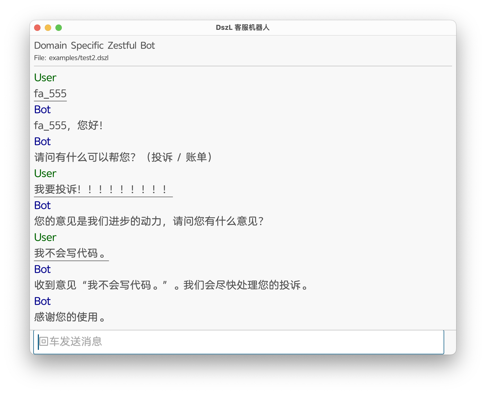
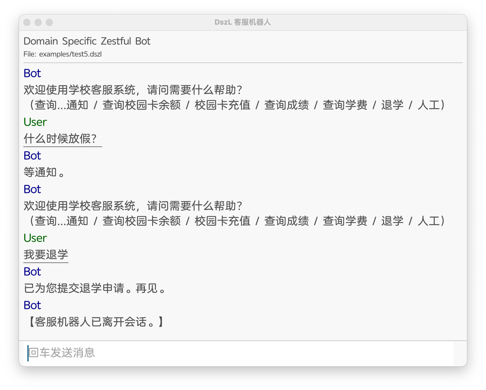
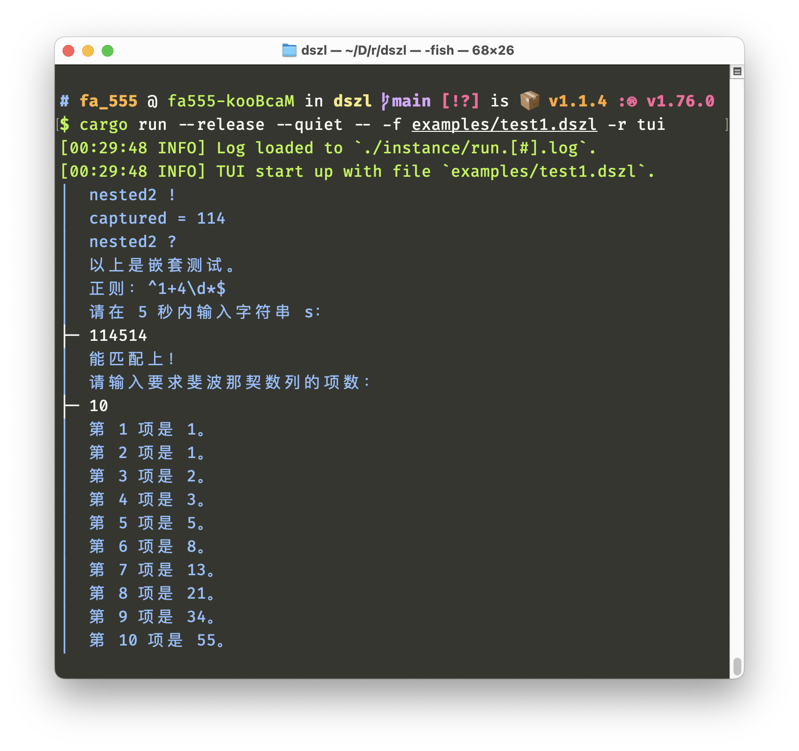
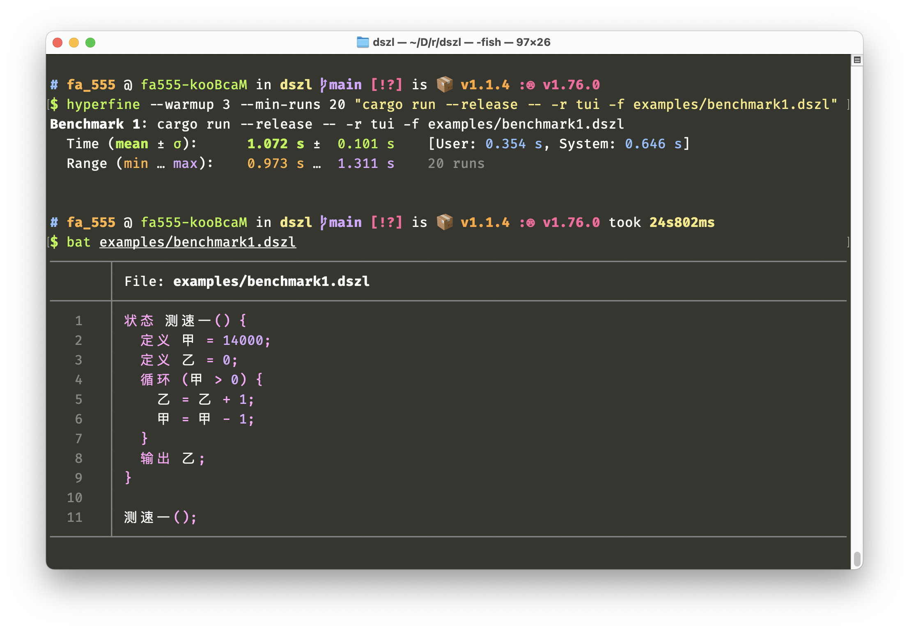
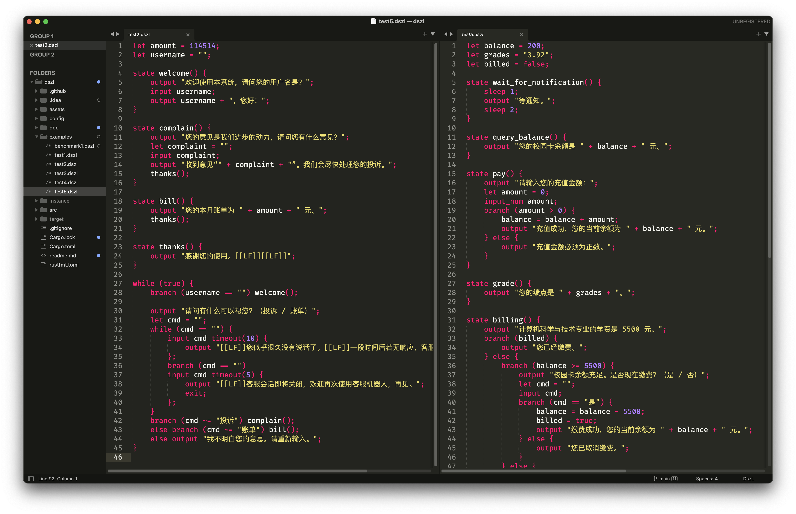

# DszL

这是一份北京邮电大学计算机科学与技术专业 2021 级大三上（2023–2024
学年度秋季学期）《程序设计实践》课程大作业。

这定语叠得够吧。

作业题目是设计一个领域特定语言（DSL），并实现一个解释器。然而我实际上是搞了个通用语言出来，不过问题不大。

## 少废话，哥们怎么运行

```shell
cargo run --release -- --help # 接下来的参数自己看吧，懒得写了
# ↓不介意的话可以试试这个，你可以跟它说句⎡我要退学⎦。
cargo run --release -- -f examples/test5.dszl -r gui

cargo doc --no-deps --open # API 文档

cargo test --release # 跑一下测试
```

什么？你没 Rust / Cargo？

```shell
curl --proto '=https' --tlsv1.2 -sSf https://sh.rustup.rs | sh # 原神，启动！
```

## 然后呢？

剩下的就不是这里该说的了。更多信息参见[给课程交上去的报告](./doc/main.pdf)。报告当时是一天水出来的，内容比较幽默，别介意。

> [!WARNING]
> 由于课程结束后本仓库代码又有更新，文档的内容可能并不完全符合现在的代码。

## 来点运行截图吧！







## Benchmark

DszL 的效率相当拉胯，在作者的机器上每秒钟仅能进行 $10^4$ 的数量级的基本运算，见下图。



## 配套设施

DszL 提供了[配套的 `.sublime-syntax` 文件](./doc/dszl.sublime-syntax)，适用于包括 [Sublime Text](https://www.sublimetext.com/)、[Typst](https://typst.app/home)、[syntect](https://github.com/trishume/syntect/) 等各种需要语法高亮并支持 [`.sublime-syntax`](https://www.sublimetext.com/docs/syntax.html) 的工具。集成方式请自行查阅相关文档。

以下是一些使用例：




与 Typst 的集成参见前文提到的本仓库附带的报告。
